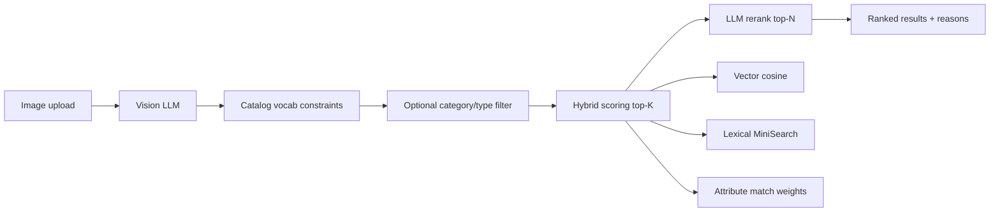

# Furniture Vision Search

**Image → ranked catalog matches** for a ~2,500-item furniture catalog — with constrained vision extraction, hybrid retrieval, LLM rerank, transparent scoring, and a static eval harness so quality is measurable, not vibes.

| | |
|---|---|
| **Try locally** | [http://localhost:5173](http://localhost:5173) after `docker compose up --build` |
| **Hosted demo** | Not deployed yet — see [docs/DEPLOYMENT.md](docs/DEPLOYMENT.md) |
| **What to judge** | Match quality + eval tooling + retrieval architecture (UI is for inspection, not the product) |

---

## Engineering judgment (read this first)

I optimized for **match quality you can inspect**, not a flashy demo UI.

The first naive approach — “send the image to GPT and ask for product IDs” — fails on real catalog search: hallucinated categories, no price constraints, no way to know if ranking got better. Styled-room photos and near-duplicates (stool vs ottoman, side table vs coffee table) exposed that quickly.

**What I built instead:**

1. **Catalog-constrained vision** — category/type/color/style/material must come from live MongoDB vocab or be `null`; no invented labels.
2. **Confidence-gated filters** — hard-filter by category/type only when vision confidence is high enough; avoids over-narrowing on uncertain photos.
3. **Hybrid retrieval** — vector similarity + lexical search + structured attribute weights + prompt price intent + dimension proximity; every score is decomposable.
4. **LLM rerank on top-K only** — expensive visual judgment reorders candidates and explains *why*; retrieval still does the heavy lifting.
5. **Static eval harness (6 cases)** — fixed images + expected labels; re-run after every retrieval change. **Live thumbs feedback** for session-level Precision@K during demos.

**Measured results (May 2026, corrected eval fixtures, hybrid retrieval, rerank off):**

| Result | Score | Plain English |
|--------|-------|---------------|
| **Category @ rank 1** | **5 / 6 cases (83%)** | Top result is in the right furniture category |
| **Attribute recall @ rank 1** | **56%** | Top result matches most expected fields (type, color, …) on average |
| **Type @ rank 1** | 33% | Exact catalog type on the top hit |
| **Color @ rank 1** | 40% | Exact color attribute on the top hit |
| **Full catalog match @ rank 1** | 1 / 6 *(strict)* | Every expected field correct on #1 — high bar with 62 types & 15 categories |
| **Latency** | ~4.9s | Vision + hybrid retrieval per case |

Category placement is strong; **fine-grained type/color on the exact SKU** is where the next iteration focuses — vision variance and near-duplicate catalog variants.

**What improved after testing:** eval images aligned with labels (metrics now measure real retrieval); prompt price intent (`under $500`) hard-filtered; rerank optional for live demos (lifts type on some cases, ~2× latency).

**Next push:** vision tuning for type/color, weight calibration on the static harness, expand eval beyond six cases.

---

## Why this is not just GPT vision

The vision model never returns catalog items directly. It extracts constrained attributes from the image, then the backend searches and ranks the catalog with multiple inspectable signals:

- **Catalog-constrained vision** avoids hallucinated labels by forcing category/type/color/style/material to come from live MongoDB vocabulary.
- **Hybrid retrieval** combines cached embedding similarity, MiniSearch lexical scores, structured attribute matches, dimensions, and prompt-derived price constraints.
- **LLM rerank** only reorders the top-K candidates and returns reasons, so expensive model judgment improves the final list without replacing retrieval.
- **Eval tooling** measures quality through a six-case static harness and live thumbs feedback rather than relying on demo vibes.

---

## Demo flow (2 minutes)

1. Open **Admin → Config** and paste your [OpenRouter](https://openrouter.ai/keys) API key (memory only).
2. **Admin → Catalog Meta** — confirm ~2,500 products; check embedding index status.
3. *(First time)* **Re-index catalog** — builds local embedding cache (~30–90s with default settings).
4. Go to **Search**, upload a clear furniture photo (single piece works best).
5. Inspect **Vision analysis** (sidebar): category, type, color, confidence %.
6. Review **ranked results** — hybrid score, rerank reason, tap score for breakdown.
7. Optional prompt: `walnut bookshelf under $500` — compare ranking changes.
8. Rate results with **Relevant / Not relevant**.
9. **Admin → Live Eval** — refresh metrics from your session.

---

## Quick start

### Prerequisites

- Docker Desktop (or Docker Engine + Compose)
- MongoDB read-only catalog URI (see `.env.example`)
- OpenRouter API key (pasted in Admin UI at runtime)

### Run

```bash
git clone https://github.com/Mis4nthr0pic/furniture-vision-search.git
cd furniture-vision-search
cp .env.example .env
# Edit .env — set MONGODB_URI (required). OPENROUTER_API_KEY optional dev fallback only.
docker compose up --build
```

| Service  | URL |
|----------|-----|
| Frontend | http://localhost:5173 |
| Backend health | http://localhost:4000/api/health |

### Deploy (demo / public URL)

Hosting needs **backend + frontend only** — reuse your existing MongoDB URI. See **[docs/DEPLOYMENT.md](docs/DEPLOYMENT.md)** (Cloudflare Tunnel, Render, or VM + Docker Compose).

### API key policy

- Keys are entered at **runtime** in Admin → Config.
- Stored in **browser memory only** (Zustand) — never `localStorage`, `sessionStorage`, or disk.
- Cleared on page refresh or server restart.
- Not logged by the backend (redacted in LLM error messages).
- Optional `OPENROUTER_API_KEY` in gitignored `.env` is a **local dev convenience** only; evaluators should use the Admin UI.

---

## System overview

This is a full-stack **image-to-product search** pipeline for furniture:

```
React UI  →  Express API  →  MongoDB catalog (read-only)
                ↓
         OpenRouter (vision, embeddings, chat/rerank)
                ↓
         Local embedding cache + MiniSearch lexical index
```

## Frontend (inspection UI)

React + Vite + Zustand + Tailwind — **deliberately minimal**. The value is in the pipeline; the UI makes quality inspection easy:

- Upload + optional prompt (`under $500`, material hints)
- Vision sidebar with per-field confidence
- Ranked results with hybrid score breakdown, rerank reason, thumbs up/down
- Admin: config, static eval, live eval, reindex progress

Salon-themed UI polish is in progress; FDE reviewers should focus on **search relevance and eval numbers**, not dashboard aesthetics.

| Layer | Tech |
|-------|------|
| Frontend | React 18, TypeScript, Vite, Tailwind, Zustand, React Router |
| Backend | Node 22, Express, TypeScript, Zod |
| Catalog | MongoDB (~2,500 enriched products) |
| Lexical | MiniSearch (in-memory BM25-style) |
| Vectors | OpenAI-compatible embeddings via OpenRouter, cached at `backend/data/embeddings.json` |
| LLM | OpenRouter — `gpt-4o` vision + chat/rerank, `text-embedding-3-small` embeddings |

---

## Retrieval and ranking pipeline

Each search runs this sequence:



### 1. Vision extraction

- Model analyzes the image against **catalog vocabulary** (categories, types, styles, colors, materials).
- Output: structured JSON — labels, description, keywords, per-field confidence (0–1).
- Labels must come from vocab or be `null` (no invented categories).
- Optional user prompt refines extraction (e.g. “modern walnut chair”).

### 2. Candidate retrieval (hybrid, top-K default 30)

| Signal | Weight (default) | Source |
|--------|------------------|--------|
| Vector similarity | 0.25 | Cached product embeddings vs query embedding |
| Lexical | 0.20 | MiniSearch on description + keywords + prompt |
| Category match | 0.15 | Exact match on vision category |
| Type match | 0.15 | Exact match on vision type |
| Color match | 0.15 | Exact match on product color attr |
| Style match | 0.05 | Exact match on product style attr |
| Material match | 0.00 | Boost when prompt mentions material |
| Dimensions | 0.05 | Proximity vs estimated dimensions |

**Auto filter:** when vision confidence ≥ threshold (default 0.7) and label is in vocab, hard-filter by category and/or type before scoring.

**Modes:** `hybrid` (default), `vector_only`, `lexical_only`, `filter_only` — configurable in Admin.

**Prompt price intent:** short constraints such as `under $500`, `between $300 and $600`, and
`around $1,200` are parsed from the optional prompt and applied as catalog price filters before
scoring. Admin can set a tolerance percent for near-budget matches.

### 3. LLM rerank (top-N default 10)

- Sends original image + vision features + user prompt + candidate summaries to chat model.
- Returns strict JSON: ranked list with **0–1 rerank score** and **natural-language reason** per item.
- One retry on parse failure; falls back to hybrid order with warning (never 500).

### 4. Live feedback

- Every search gets a `searchId`.
- Thumbs up/down → `POST /api/eval/rate` for rolling Precision@5, Precision@10, MRR in Admin.

### Understanding scores

| Metric | Range | Meaning |
|--------|-------|---------|
| **Vision confidence** | 0–1 | Model certainty per extracted field — *not* match quality |
| **Hybrid score** | ~0.1–0.6 typical | Weighted sum of retrieval signals for one product |
| **Rerank score** | 0–1 | LLM judgment of visual/catalog fit |

Low vision confidence (< 0.7) is common — filters won’t narrow the catalog, but vectors + lexical + rerank still run.

---

## Admin configuration

**Admin → Config** controls the full pipeline (all settings in Zustand, shared with Search):

| Setting | Purpose |
|---------|---------|
| OpenRouter API key | Enables vision, embeddings, rerank |
| Vision / chat / embed models | OpenRouter model IDs |
| Retrieval mode | hybrid / vector / lexical / filter |
| Top K / Top N | Candidate pool size and final result count |
| Ranking weights | Hybrid score component weights |
| Confidence threshold | When auto category/type filters apply |
| Price tolerance % | How much prompt-derived budget filters may stretch |
| Enable rerank | LLM rerank on/off |
| Include image in rerank | Pass original photo to rerank prompt |
| Re-index catalog | Build embedding cache with SSE progress modal |

Other tabs:

- **Static Eval** — runs 6 fixed cases (`POST /api/eval/run`), reports category/type/color accuracy, MRR, latency.
- **Live Eval** — session metrics and recent search logs from thumbs feedback.
- **Catalog Meta** — product counts, vocab sizes, embedding index status.

---

## Evaluation approach

Quality is the point. The UI exists so evaluators can **see vision output, score breakdowns, rerank reasons, and thumbs feedback** — not to impress on aesthetics alone.

### Static eval (offline harness)

Six fixed furniture photos with labeled expectations — re-run after any retrieval change. See [docs/EVAL.md](./docs/EVAL.md) for metric definitions.

**Recorded baseline** (May 2026, OpenRouter `openai/gpt-4o`, cached embeddings, corrected fixtures):

| | Category @ #1 | Attr recall @ #1 | Type @ #1 | Color @ #1 | Full match @ #1 *(strict)* | Latency |
|---|:---:|:---:|:---:|:---:|:---:|:---:|
| **Hybrid** | **83%** (5/6) | **56%** | 33% | 40% | 17% (1/6) | 4.9s |
| Hybrid + rerank* | 83% | 56% | 50% | 33% | — | ~11s |

\*Rerank replayed via `/api/search`; directional only on n=6.

**How to read this:** Most cases land in the **correct category at rank 1**. The **strict full-match** column requires exact type *and* color on #1 — useful for QA, not the only signal that search is working. For live demos, thumbs feedback (Live Eval) captures perceived relevance.

**Active improvement area:** type/color precision when the catalog has many similar variants (e.g. Wide vs Tall Bookshelf, Natural vs Gray).

Run via **Admin → Static Eval** or:

```bash
curl -X POST http://localhost:4000/api/eval/run \
  -H "Content-Type: application/json" \
  -d '{"llmConfig":{"apiKey":"YOUR_KEY"}}'
```

Full guide: [docs/EVAL.md](./docs/EVAL.md) · Baselines also in [CHANGELOG.md](./CHANGELOG.md)

### Live eval (human feedback)

- Precision@5, Precision@10, MRR computed from in-memory search logs (LRU 200).
- Driven by thumbs up/down on the Search page during demo sessions.

---

## Key design choices and tradeoffs

| Choice | Why |
|--------|-----|
| **OpenRouter-only LLM** | One API key for vision, chat, rerank, and embeddings — no separate OpenAI account |
| **Catalog-constrained vision** | Prevents hallucinated categories; enables hard filters and attribute scoring |
| **Hybrid retrieval** | Vectors catch semantic similarity; lexical + attributes handle exact catalog structure |
| **Cached embeddings** | 2,500 products embed once (~30–90s reindex); avoids per-search embedding cost |
| **LLM rerank on top-K only** | Quality lift on final list without scoring entire catalog with vision |
| **Memory-only API key** | Challenge compliance — no persisted secrets in browser or repo |
| **No admin auth** | Localhost demo; not production-hardened |
| **In-memory eval logs** | Simple rolling metrics; not durable across restarts |

---

## Edge cases

| Situation | Behavior |
|-----------|----------|
| No API key | Search blocked; banner links to Admin |
| Embeddings not built | Hybrid runs with `w_vec=0`, weight redistributed to lexical; warning in response |
| Low vision confidence | No category/type hard filter; amber note in vision sidebar |
| Rerank parse failure | Falls back to hybrid order + `rerank_error` warning |
| Empty filter result | Returns empty ranked list with info alert |
| Rate limit during reindex | Exponential backoff + Retry-After; progress modal shows retry status |
| Non-furniture / unclear image | Vision may return null labels; results depend on description + vectors |

---

## Scaling beyond 2,500 products

Current architecture (deliberately simple):

```
2,500 products → local JSON embedding cache → in-memory cosine similarity
              → MiniSearch lexical index → hybrid top-K → LLM rerank top-N
```

**Future path (documented seam, not implemented):**

| Scale step | Approach |
|------------|----------|
| 10K–100K | MongoDB Atlas Vector Search; async embedding worker; incremental index updates |
| Lexical | OpenSearch / Elasticsearch for full-text at scale |
| Rerank cost | Reduce top-K, cache rerank for popular queries, smaller rerank model |
| Feedback | Log ratings to DB → learning-to-rank or weight tuning |
| Multi-tenant | Auth, per-tenant keys, isolated indexes |

The `Retriever` interface in `backend/src/services/retrieval.service.ts` is the explicit swap point for vector backends.

---

## Project structure

```
fortune/
├── backend/                 # Express API — see backend/README.md
├── frontend/                # React SPA — see frontend/README.md
├── docs/PIPELINE.md         # Incremental build roadmap
├── CHANGELOG.md             # Narrative + eval baselines
├── docs/changelog/          # Per-PR decision log (one file per merge)
└── docker-compose.yml
```

---

## API reference (summary)

| Method | Path | Purpose |
|--------|------|---------|
| GET | `/api/health` | Health + catalog/embeddings status |
| POST | `/api/search` | Full pipeline (multipart: image + JSON payload) |
| POST | `/api/vision/debug` | Vision-only debug |
| POST | `/api/lexical/debug` | Lexical search debug |
| GET | `/api/admin/catalog-meta` | Catalog stats + embedding status |
| POST | `/api/admin/reindex` | Build embedding cache |
| GET | `/api/admin/reindex-progress` | SSE progress stream |
| POST | `/api/eval/run` | Static eval harness |
| POST | `/api/eval/rate` | Live rating |
| GET | `/api/eval/metrics` | Live eval metrics |
| GET | `/api/eval/logs` | Recent search logs |

---

## Development

### Tests

**94 unit tests** (71 backend + 23 frontend) via Vitest. See [docs/TESTING.md](docs/TESTING.md) for the full file list and edge-case matrix.

```bash
npm install          # root Biome tooling
npm test             # run all Vitest suites (71 backend + 23 frontend)
npm run check        # lint + typecheck + test
```

```bash
cd backend && npm test    # 71 tests — retrieval, validation, HTTP integration
cd frontend && npm test   # 23 tests — hooks, components, store
```

CI runs **Backend unit tests (Vitest)**, **Frontend unit tests (Vitest)**, **Lint (Biome)**, **Unit test summary**, and **Root check (lint + typecheck + tests)** jobs on every PR ([Actions](https://github.com/Mis4nthr0pic/furniture-vision-search/actions/workflows/ci.yml)).

### Local without Docker

```bash
# Terminal 1 — backend (requires .env with MONGODB_URI)
cd backend && npm install && npm run dev

# Terminal 2 — frontend (proxies /api to :4000)
cd frontend && npm install && npm run dev
```

### Incremental delivery

See [docs/PIPELINE.md](docs/PIPELINE.md) for the step-by-step build history and PR workflow.

### Environment variables

All tunables are in [`.env.example`](./.env.example). Key groups:

- **MongoDB** — catalog connection (required)
- **LLM** — OpenRouter URLs and model IDs
- **Embeddings build** — batch size, concurrency, retry/backoff for rate limits
- **Upload / CORS** — limits and origins

---

## Screenshots

Add captures to `docs/screenshots/` for README embedding:

| File | What to capture |
|------|-----------------|
| `search-upload.png` | Search page with image uploaded |
| `vision-features.png` | Vision sidebar with confidence % |
| `ranked-results.png` | Results with scores and rerank reasons |
| `admin-config.png` | Admin Config tab |
| `admin-eval.png` | Static or Live Eval dashboard |
| `reindex-progress.png` | Reindex progress modal |

---

## Future enhancements

- Richer structured prompt intent (excluded colors, room/use-case constraints)
- Deterministic “Matched because” bullets from score contributions
- Richer empty/low-confidence UX states
- Persistent eval logs and export
- CI-published eval baseline artifacts

---

## License & catalog

MongoDB catalog is read-only. Eval images are from Unsplash (see `backend/eval/`). Built as an incremental pipeline project — full decision log in [docs/changelog/README.md](./docs/changelog/README.md).
