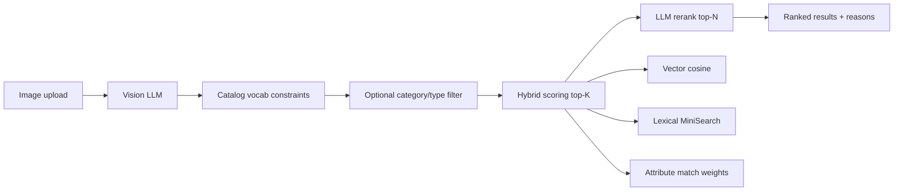

# Furniture Vision Search

Upload a furniture photo and get ranked matches from a ~2,500-item catalog — with vision extraction, hybrid retrieval, LLM rerank, transparent scoring, and an admin workspace for config and evaluation.

**Live demo (local):** [http://localhost:5173](http://localhost:5173)

---

## Demo flow (2 minutes)

1. Open **Admin → Config** and paste your [OpenRouter](https://openrouter.ai/keys) API key (memory only).
2. **Admin → Catalog Meta** — confirm ~2,500 products; check embedding index status.
3. *(First time)* **Re-index catalog** — builds local embedding cache (~30–90s with default settings).
4. Go to **Search**, upload a clear furniture photo (single piece works best).
5. Inspect **Vision analysis** (sidebar): category, type, color, confidence %.
6. Review **ranked results** — hybrid score, rerank reason, tap score for breakdown.
7. Optional prompt: `walnut bookshelf under $500` — compare ranking changes.
8. Rate results with **Relevant / Not relevant**.
9. **Admin → Live Eval** — refresh metrics from your session.

---

## Quick start

### Prerequisites

- Docker Desktop (or Docker Engine + Compose)
- MongoDB read-only catalog URI (see `.env.example`)
- OpenRouter API key (pasted in Admin UI at runtime)

### Run

```bash
git clone https://github.com/Mis4nthr0pic/furniture-vision-search.git
cd furniture-vision-search
cp .env.example .env
# Edit .env — set MONGODB_URI (required). OPENROUTER_API_KEY optional dev fallback only.
docker compose up --build
```

| Service  | URL |
|----------|-----|
| Frontend | http://localhost:5173 |
| Backend health | http://localhost:4000/api/health |

### API key policy

- Keys are entered at **runtime** in Admin → Config.
- Stored in **browser memory only** (Zustand) — never `localStorage`, `sessionStorage`, or disk.
- Cleared on page refresh or server restart.
- Not logged by the backend (redacted in LLM error messages).
- Optional `OPENROUTER_API_KEY` in gitignored `.env` is a **local dev convenience** only; evaluators should use the Admin UI.

---

## System overview

This is a full-stack **image-to-product search** pipeline for furniture:

```
React UI  →  Express API  →  MongoDB catalog (read-only)
                ↓
         OpenRouter (vision, embeddings, chat/rerank)
                ↓
         Local embedding cache + MiniSearch lexical index
```

| Layer | Tech |
|-------|------|
| Frontend | React 18, TypeScript, Vite, Tailwind, Zustand, React Router |
| Backend | Node 22, Express, TypeScript, Zod |
| Catalog | MongoDB (~2,500 enriched products) |
| Lexical | MiniSearch (in-memory BM25-style) |
| Vectors | OpenAI-compatible embeddings via OpenRouter, cached at `backend/data/embeddings.json` |
| LLM | OpenRouter — `gpt-4o` vision + chat/rerank, `text-embedding-3-small` embeddings |

---

## Retrieval and ranking pipeline

Each search runs this sequence:



### 1. Vision extraction

- Model analyzes the image against **catalog vocabulary** (categories, types, styles, colors, materials).
- Output: structured JSON — labels, description, keywords, per-field confidence (0–1).
- Labels must come from vocab or be `null` (no invented categories).
- Optional user prompt refines extraction (e.g. “modern walnut chair”).

### 2. Candidate retrieval (hybrid, top-K default 30)

| Signal | Weight (default) | Source |
|--------|------------------|--------|
| Vector similarity | 0.25 | Cached product embeddings vs query embedding |
| Lexical | 0.20 | MiniSearch on description + keywords + prompt |
| Category match | 0.15 | Exact match on vision category |
| Type match | 0.15 | Exact match on vision type |
| Color match | 0.15 | Exact match on product color attr |
| Style match | 0.05 | Exact match on product style attr |
| Material match | 0.00 | Boost when prompt mentions material |
| Dimensions | 0.05 | Proximity vs estimated dimensions |

**Auto filter:** when vision confidence ≥ threshold (default 0.7) and label is in vocab, hard-filter by category and/or type before scoring.

**Modes:** `hybrid` (default), `vector_only`, `lexical_only`, `filter_only` — configurable in Admin.

### 3. LLM rerank (top-N default 10)

- Sends original image + vision features + user prompt + candidate summaries to chat model.
- Returns strict JSON: ranked list with **0–1 rerank score** and **natural-language reason** per item.
- One retry on parse failure; falls back to hybrid order with warning (never 500).

### 4. Live feedback

- Every search gets a `searchId`.
- Thumbs up/down → `POST /api/eval/rate` for rolling Precision@5, Precision@10, MRR in Admin.

### Understanding scores

| Metric | Range | Meaning |
|--------|-------|---------|
| **Vision confidence** | 0–1 | Model certainty per extracted field — *not* match quality |
| **Hybrid score** | ~0.1–0.6 typical | Weighted sum of retrieval signals for one product |
| **Rerank score** | 0–1 | LLM judgment of visual/catalog fit |

Low vision confidence (< 0.7) is common — filters won’t narrow the catalog, but vectors + lexical + rerank still run.

---

## Admin configuration

**Admin → Config** controls the full pipeline (all settings in Zustand, shared with Search):

| Setting | Purpose |
|---------|---------|
| OpenRouter API key | Enables vision, embeddings, rerank |
| Vision / chat / embed models | OpenRouter model IDs |
| Retrieval mode | hybrid / vector / lexical / filter |
| Top K / Top N | Candidate pool size and final result count |
| Ranking weights | Hybrid score component weights |
| Confidence threshold | When auto category/type filters apply |
| Enable rerank | LLM rerank on/off |
| Include image in rerank | Pass original photo to rerank prompt |
| Re-index catalog | Build embedding cache with SSE progress modal |

Other tabs:

- **Static Eval** — runs 6 fixed cases (`POST /api/eval/run`), reports category/type/color accuracy, MRR, latency.
- **Live Eval** — session metrics and recent search logs from thumbs feedback.
- **Catalog Meta** — product counts, vocab sizes, embedding index status.

---

## Evaluation approach

### Static eval (offline harness)

- **6 cases** in `backend/eval/` — Ottomans, Bookshelves, Benches, Chairs, Coffee Tables, Sofas.
- Images from Unsplash (committed under `backend/eval/images/`).
- Runs vision + hybrid retrieval (rerank off) per case.
- Metrics: top-1 / top-10 category & type match, color match, attribute recall@1, MRR, avg latency.

Run via **Admin → Static Eval** or:

```bash
curl -X POST http://localhost:4000/api/eval/run \
  -H "Content-Type: application/json" \
  -d '{"llmConfig":{"apiKey":"YOUR_KEY"}}'
```

Full guide: [docs/EVAL.md](./docs/EVAL.md)

> **Baseline numbers:** run locally with your OpenRouter key and record results in [CHANGELOG.md](./CHANGELOG.md). Metrics vary by model and embedding cache state.

### Live eval (human feedback)

- Precision@5, Precision@10, MRR computed from in-memory search logs (LRU 200).
- Driven by thumbs up/down on the Search page during demo sessions.

---

## Key design choices and tradeoffs

| Choice | Why |
|--------|-----|
| **OpenRouter-only LLM** | One API key for vision, chat, rerank, and embeddings — no separate OpenAI account |
| **Catalog-constrained vision** | Prevents hallucinated categories; enables hard filters and attribute scoring |
| **Hybrid retrieval** | Vectors catch semantic similarity; lexical + attributes handle exact catalog structure |
| **Cached embeddings** | 2,500 products embed once (~30–90s reindex); avoids per-search embedding cost |
| **LLM rerank on top-K only** | Quality lift on final list without scoring entire catalog with vision |
| **Memory-only API key** | Challenge compliance — no persisted secrets in browser or repo |
| **No admin auth** | Localhost demo; not production-hardened |
| **In-memory eval logs** | Simple rolling metrics; not durable across restarts |

---

## Edge cases

| Situation | Behavior |
|-----------|----------|
| No API key | Search blocked; banner links to Admin |
| Embeddings not built | Hybrid runs with `w_vec=0`, weight redistributed to lexical; warning in response |
| Low vision confidence | No category/type hard filter; amber note in vision sidebar |
| Rerank parse failure | Falls back to hybrid order + `rerank_error` warning |
| Empty filter result | Returns empty ranked list with info alert |
| Rate limit during reindex | Exponential backoff + Retry-After; progress modal shows retry status |
| Non-furniture / unclear image | Vision may return null labels; results depend on description + vectors |

---

## Scaling beyond 2,500 products

Current architecture (deliberately simple):

```
2,500 products → local JSON embedding cache → in-memory cosine similarity
              → MiniSearch lexical index → hybrid top-K → LLM rerank top-N
```

**Future path (documented seam, not implemented):**

| Scale step | Approach |
|------------|----------|
| 10K–100K | MongoDB Atlas Vector Search; async embedding worker; incremental index updates |
| Lexical | OpenSearch / Elasticsearch for full-text at scale |
| Rerank cost | Reduce top-K, cache rerank for popular queries, smaller rerank model |
| Feedback | Log ratings to DB → learning-to-rank or weight tuning |
| Multi-tenant | Auth, per-tenant keys, isolated indexes |

The `Retriever` interface in `backend/src/services/retrieval.service.ts` is the explicit swap point for vector backends.

---

## Project structure

```
fortune/
├── backend/                 # Express API — see backend/README.md
├── frontend/                # React SPA — see frontend/README.md
├── docs/PIPELINE.md         # Incremental build roadmap
├── CHANGELOG.md             # Step-by-step decisions and narrative
└── docker-compose.yml
```

---

## API reference (summary)

| Method | Path | Purpose |
|--------|------|---------|
| GET | `/api/health` | Health + catalog/embeddings status |
| POST | `/api/search` | Full pipeline (multipart: image + JSON payload) |
| POST | `/api/vision/debug` | Vision-only debug |
| POST | `/api/lexical/debug` | Lexical search debug |
| GET | `/api/admin/catalog-meta` | Catalog stats + embedding status |
| POST | `/api/admin/reindex` | Build embedding cache |
| GET | `/api/admin/reindex-progress` | SSE progress stream |
| POST | `/api/eval/run` | Static eval harness |
| POST | `/api/eval/rate` | Live rating |
| GET | `/api/eval/metrics` | Live eval metrics |
| GET | `/api/eval/logs` | Recent search logs |

---

## Development

### Tests

```bash
cd backend && npm test
cd frontend && npm test
```

CI runs both on push to `main` (GitHub Actions).

### Local without Docker

```bash
# Terminal 1 — backend (requires .env with MONGODB_URI)
cd backend && npm install && npm run dev

# Terminal 2 — frontend (proxies /api to :4000)
cd frontend && npm install && npm run dev
```

### Incremental delivery

See [docs/PIPELINE.md](docs/PIPELINE.md) for the step-by-step build history and PR workflow.

### Environment variables

All tunables are in [`.env.example`](./.env.example). Key groups:

- **MongoDB** — catalog connection (required)
- **LLM** — OpenRouter URLs and model IDs
- **Embeddings build** — batch size, concurrency, retry/backoff for rate limits
- **Upload / CORS** — limits and origins

---

## Screenshots

Add captures to `docs/screenshots/` for README embedding:

| File | What to capture |
|------|-----------------|
| `search-upload.png` | Search page with image uploaded |
| `vision-features.png` | Vision sidebar with confidence % |
| `ranked-results.png` | Results with scores and rerank reasons |
| `admin-config.png` | Admin Config tab |
| `admin-eval.png` | Static or Live Eval dashboard |
| `reindex-progress.png` | Reindex progress modal |

---

## Future enhancements

- Structured prompt intent (price max, material filters, excluded colors)
- Deterministic “Matched because” bullets from score contributions
- Richer empty/low-confidence UX states
- Persistent eval logs and export
- README baseline eval numbers from CI or recorded run

---

## License & catalog

MongoDB catalog is read-only. Eval images are from Unsplash (see `backend/eval/`). Built as an incremental pipeline project — full decision log in [CHANGELOG.md](./CHANGELOG.md).
