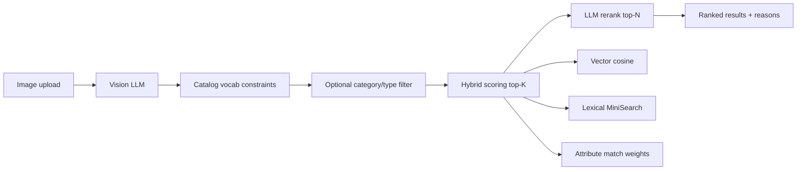

# Furniture Vision Search

**Image → ranked catalog matches** for a ~2,500-item furniture catalog — constrained vision extraction, hybrid retrieval, LLM rerank, transparent scoring, and a static eval harness.

---

## For evaluators — run and test (start here)

This section is the full path from clone to verified search and automated quality checks. Read this first; architecture and design rationale are below.

### What you need

| Requirement | Details |
|-------------|---------|
| **Docker** | Docker Desktop (Mac/Windows) or Docker Engine + Compose v2 (Linux) |
| **MongoDB URI** | Read-only connection string to the furniture catalog (~2,500 products). Set in `.env` as `MONGODB_URI`. |
| **OpenRouter API key** | [openrouter.ai/keys](https://openrouter.ai/keys) — used for vision, embeddings, and rerank. Entered in the **Admin UI** at runtime (not committed to git). |
| **Git** | To clone the repository |

Optional for local dev without Docker: Node.js **22+** and npm.

### Hosted demo (Render free tier)

If you are testing the **live deployment** instead of Docker locally:

| | URL |
|---|-----|
| **App (use this in the browser)** | https://furniture-vision-search-1.onrender.com |
| **Health check (wake the API)** | https://furniture-vision-search-1.onrender.com/api/health |

The demo runs as **two Render web services** (frontend + backend). The frontend nginx proxies `/api/*` to the backend — always use the **frontend URL** above, not the backend hostname directly.

**Cold start (important):** on Render’s free tier, both services **sleep after ~15 minutes** of inactivity. The first request after sleep can take **30–60 seconds**. Until the backend is awake you may see:

- A **yellow banner** at the top of the app (“Backend API may be offline”)
- Re-index or search errors mentioning a **gateway** or **502**
- JSON parse errors if a proxy returns HTML instead of JSON

**What to do:** open the [health check link](https://furniture-vision-search-1.onrender.com/api/health) in a **new tab**, wait until the response shows `"ok": true`, then return to the app and retry (re-index, search, etc.). Keep the health tab open while the first re-index runs if the backend was cold.

After a **redeploy**, run **Re-index catalog** again — the free tier has no persistent disk, so embeddings are not kept across deploys.

---

### Step 1 — Clone and configure environment

```bash
git clone https://github.com/Mis4nthr0pic/furniture-vision-search.git
cd furniture-vision-search
cp .env.example .env
```

Edit `.env` at the **repo root** (same folder as `docker-compose.yml`):

```bash
# Required — paste your read-only catalog URI
MONGODB_URI=mongodb+srv://<user>:<password>@<cluster>/<db>

# Defaults below usually work for local Docker; leave unless you know you need to change them
MONGODB_DB_NAME=catalog
MONGODB_PRODUCTS_COLLECTION=products
CORS_ORIGIN=http://localhost:5173
OPENROUTER_REFERER=http://localhost:5173
OPENROUTER_TITLE=Furniture Search
```

**Where env is loaded**

| Setup | Backend reads config from |
|-------|---------------------------|
| **Docker Compose** (recommended) | Root `.env` → injected into the backend container via `docker-compose.yml` |
| **Local `npm run dev` in `backend/`** | `backend/.env` if present, else `../.env` (repo root) |
| **Hosted (Render, etc.)** | Platform environment variables on the **backend service only** — no `.env` file in the image |

The **frontend container does not use a `.env` file**. It needs one env var at runtime:

| Variable | Local Docker | Render (frontend service) |
|----------|--------------|---------------------------|
| `BACKEND_URL` | Set automatically to `http://backend:4000` | **Required** — e.g. `https://your-api.onrender.com` |

nginx proxies browser requests from `/api/*` on the frontend URL to `BACKEND_URL`. The React app always uses relative `/api` paths — no build-time config.

Optional **local dev only** (`npm run dev`): `VITE_API_URL=http://localhost:4000` in `frontend/.env` for the Vite proxy.

Optional: `OPENROUTER_API_KEY=sk-or-v1-…` in `.env` is a **local dev fallback** only (`NODE_ENV=development`). Evaluators should use **Admin → Config** instead so keys are never written to disk.

---

### Step 2 — Start the app (Docker)

From the repo root:

```bash
docker compose up --build
```

Leave this terminal open. First build takes a few minutes; later starts are faster.

| Service | URL | Role |
|---------|-----|------|
| **Frontend** | http://localhost:5173 | React UI (nginx serves static files + proxies `/api`) |
| **Backend** | http://localhost:4000 | Express API (also reachable directly for health/debug) |

Stop with `Ctrl+C`, or run detached: `docker compose up --build -d` and `docker compose down` to stop.

---

### Step 3 — Verify the stack is healthy

**Backend health** (run in a second terminal):

```bash
curl -s http://localhost:4000/api/health | jq
```

**Expected response** (approximate):

```json
{
  "ok": true,
  "productCount": 2500,
  "lexicalReady": true,
  "embeddingsReady": true
}
```

| Field | Meaning |
|-------|---------|
| `ok` | MongoDB connection and catalog load succeeded |
| `productCount` | Should be ~2500 |
| `lexicalReady` | In-memory MiniSearch index built |
| `embeddingsReady` | Vector cache exists at `backend/data/embeddings.json` (persisted in Docker volume `backend-data`) |

If `ok` is `false` or `productCount` is 0 → check `MONGODB_URI`, network access to Atlas, and IP allowlist on the cluster.

If `embeddingsReady` is `false` → hybrid search still runs (lexical + attributes) but vector signal is off until you **Re-index** (Step 5).

**Frontend smoke check:** open http://localhost:5173 — you should see **Furniture Search** in the header with **Search** and **Admin** tabs.

---

### Step 4 — Add your OpenRouter API key

1. Open http://localhost:5173/admin (or click **Admin** in the header).
2. Go to the **Config** tab (default).
3. Paste your OpenRouter key into **OpenRouter API key**.
4. Leave models at defaults unless testing alternatives:
   - Vision: `openai/gpt-4o`
   - Chat / rerank: `openai/gpt-4o`
   - Embeddings: `openai/text-embedding-3-small`

**Key policy (important for review)**

- Stored in **browser memory only** (Zustand) — not `localStorage`, not the server, not logs.
- **Clears on page refresh** — you will need to paste it again after reload.
- Backend redacts keys in error messages.

Until a key is set, Search shows a warning banner and search requests will fail.

---

### Step 5 — Build the embedding index (first time or after fresh volume)

Required for full **hybrid** retrieval (vector + lexical + attributes).

1. **Admin → Config** tab.
2. Scroll to **Re-index catalog** → click **Re-index catalog**.
3. A progress modal opens — keep the tab open (~30–90 seconds with default rate limits).
4. When complete, confirm in **Admin → Catalog** that embedding status shows ready.

Embeddings are cached in the Docker volume `backend-data` and survive container restarts. A **new clone** or **deleted volume** requires reindex again.

---

### Step 6 — Manual test checklist (UI)

Use this to validate end-to-end behavior in ~5 minutes.

#### A. Search flow

1. Go to **Search** (http://localhost:5173/).
2. **Upload** a clear photo of a single furniture piece (drag-drop or click). Styled room photos work but single-item shots are easier to judge.
3. Optional **prompt** examples:
   - `walnut bookshelf under $500`
   - `yellow accent chair`
   - `modern coffee table between $300 and $600`
4. Click **Search**.
5. While loading, confirm the progress strip shows phases: **VSN** (vision) → **IDX** (retrieval) → **RNK** (rerank, if enabled).
6. When results appear:
   - **Reference card** (left): uploaded image + vision fields (type, material, color, style) with confidence where available.
   - **Results table**: ranked products with hybrid score; click a score for **breakdown** (vector, lexical, category, type, color, …).
   - **Rerank reason** text when rerank is on.
7. Click **Relevant** / **Not relevant** on a result — feeds live eval metrics.

#### B. Admin — static quality harness

1. **Admin → Evaluation** tab.
2. Click **Run static eval** (uses the same API key from Config).
3. Wait ~30s (6 cases × vision + retrieval each).
4. Review summary cards:
   - **Category @ #1** — primary signal (baseline ~83%, 5/6)
   - **Attribute recall @ #1**, **Type @ #1**, **Color @ #1**
   - **Full match @ #1** — strict all-fields-on-#1 bar (~1/6)
   - Per-case table: Pass/Miss, top match vs expected

See [docs/EVAL.md](./docs/EVAL.md) for metric definitions.

#### C. Admin — live session metrics

1. Run a few searches and rate results with thumbs.
2. **Admin → Live metrics** tab → refresh.
3. Confirm **Precision@5**, **Precision@10**, **MRR** update from your session.

#### D. Admin — catalog inspection

1. **Admin → Catalog** tab.
2. Confirm category/type/color/material vocab counts and total products (~2500).

#### E. Optional toggles (Config tab)

| Setting | What to try |
|---------|-------------|
| **Enable rerank** | On (default in UI) — better type fit on some cases, ~2× latency |
| **Retrieval mode** | `hybrid` vs `lexical_only` / `vector_only` to inspect signal contribution |
| **Ranking weights** | Adjust `w_vec`, `w_lex`, etc., re-run search |
| **Confidence threshold** | Higher = stricter category/type hard filters |

---

### Step 7 — Automated tests (CLI)

From repo root after `npm install` (installs root Biome linter):

```bash
npm run lint          # Biome — formatting + lint (137 files)
npm run typecheck     # tsc backend + frontend
npm test              # Vitest: backend + frontend unit tests
npm run check         # lint + typecheck + test (full gate)
```

Or run suites separately:

```bash
cd backend && npm install && npm test    # 72 backend unit tests
cd frontend && npm install && npm test   # 28 frontend unit tests
```

CI runs the same checks on every PR ([GitHub Actions](https://github.com/Mis4nthr0pic/furniture-vision-search/actions)).

**Static eval via API** (same harness as Admin UI):

```bash
curl -s -X POST http://localhost:4000/api/eval/run \
  -H "Content-Type: application/json" \
  -d '{"llmConfig":{"apiKey":"YOUR_OPENROUTER_KEY","visionModel":"openai/gpt-4o","chatModel":"openai/gpt-4o","embedModel":"openai/text-embedding-3-small"}}' \
  | jq '.summary'
```

Requires backend running, valid API key, and `embeddingsReady: true` for meaningful vector scores.

---

### Step 8 — Run without Docker (optional)

Two terminals, repo root `.env` with `MONGODB_URI`:

```bash
# Terminal 1 — API on :4000
cd backend && npm install && npm run dev

# Terminal 2 — Vite on :5173, proxies /api → :4000
cd frontend && npm install && npm run dev
```

Open http://localhost:5173. Paste OpenRouter key in Admin → Config.

---

### Troubleshooting

| Symptom | Likely cause | Fix |
|---------|--------------|-----|
| `productCount: 0` or health `ok: false` | Bad `MONGODB_URI` or Atlas IP block | Fix URI; allow your IP (or `0.0.0.0/0` for demo) in Atlas Network Access |
| Search fails immediately | No API key in Admin | Admin → Config → paste OpenRouter key |
| Search slow / 401 on LLM | Invalid or expired key | New key at openrouter.ai; refresh page and re-paste |
| Warning: embeddings not ready | No index built yet | Admin → Config → Re-index catalog |
| Empty results after filter | Price prompt too strict | Try without price or widen **Price tolerance %** in Config |
| Re-index fails / rate limit | OpenRouter throttling | Wait; modal shows retry/backoff; reduce concurrency in `.env` if needed |
| `502 Bad Gateway`, HTML/JSON parse error, or “Backend unavailable” | Render backend still waking up or offline | Open `/api/health` in a new tab; wait for `"ok": true`; use the app banner **Check again** if shown |
| Key gone after refresh | By design (memory-only) | Re-paste in Admin → Config |
| Port already in use | Old containers running | `docker compose down` then `up --build` |
| CORS error in browser | Split deploy (frontend and backend on different URLs) | See [docs/DEPLOYMENT.md](./docs/DEPLOYMENT.md); demo branch may allow all origins for testing |

---

### Quick reference — URLs and tabs

| URL | Purpose |
|-----|---------|
| http://localhost:5173 | Main UI — Search |
| http://localhost:5173/admin | Admin — Config, Evaluation, Live metrics, Catalog |
| http://localhost:4000/api/health | Backend health JSON |

| Admin tab | Purpose |
|-----------|---------|
| **Config** | API key, models, retrieval weights, rerank, re-index |
| **Evaluation** | Static eval harness (6 cases) |
| **Live metrics** | Session thumbs feedback metrics |
| **Catalog** | Vocab sizes, product count, embedding status |

**Hosted demo:** see [docs/DEPLOYMENT.md](docs/DEPLOYMENT.md) (Render, Cloudflare Tunnel, or VM).

---

## Engineering judgment

I optimized for **match quality you can inspect**, not a flashy demo UI.

The first naive approach — “send the image to GPT and ask for product IDs” — fails on real catalog search: hallucinated categories, no price constraints, no way to know if ranking got better. Styled-room photos and near-duplicates (stool vs ottoman, side table vs coffee table) exposed that quickly.

**What I built instead:**

1. **Catalog-constrained vision** — category/type/color/style/material must come from live MongoDB vocab or be `null`; no invented labels.
2. **Confidence-gated filters** — hard-filter by category/type only when vision confidence is high enough; avoids over-narrowing on uncertain photos.
3. **Hybrid retrieval** — vector similarity + lexical search + structured attribute weights + prompt price intent + dimension proximity; every score is decomposable.
4. **LLM rerank on top-K only** — expensive visual judgment reorders candidates and explains *why*; retrieval still does the heavy lifting.
5. **Static eval harness (6 cases)** — fixed images + expected labels; re-run after every retrieval change. **Live thumbs feedback** for session-level Precision@K during demos.

**Measured results (May 2026, corrected eval fixtures, hybrid retrieval, rerank off):**

| Result | Score | Plain English |
|--------|-------|---------------|
| **Category @ rank 1** | **5 / 6 cases (83%)** | Top result is in the right furniture category |
| **Attribute recall @ rank 1** | **56%** | Top result matches most expected fields (type, color, …) on average |
| **Type @ rank 1** | 33% | Exact catalog type on the top hit |
| **Color @ rank 1** | 40% | Exact color attribute on the top hit |
| **Full catalog match @ rank 1** | 1 / 6 *(strict)* | Every expected field correct on #1 — high bar with 62 types & 15 categories |
| **Latency** | ~4.9s | Vision + hybrid retrieval per case |

Category placement is strong; **fine-grained type/color on the exact SKU** is where the next iteration focuses — vision variance and near-duplicate catalog variants.

**What improved after testing:** eval images aligned with labels (metrics now measure real retrieval); prompt price intent (`under $500`) hard-filtered; rerank optional for live demos (lifts type on some cases, ~2× latency).

**Next push:** vision tuning for type/color, weight calibration on the static harness, expand eval beyond six cases.

---

## Why this is not just GPT vision

The vision model never returns catalog items directly. It extracts constrained attributes from the image, then the backend searches and ranks the catalog with multiple inspectable signals:

- **Catalog-constrained vision** avoids hallucinated labels by forcing category/type/color/style/material to come from live MongoDB vocabulary.
- **Hybrid retrieval** combines cached embedding similarity, MiniSearch lexical scores, structured attribute matches, dimensions, and prompt-derived price constraints.
- **LLM rerank** only reorders the top-K candidates and returns reasons, so expensive model judgment improves the final list without replacing retrieval.
- **Eval tooling** measures quality through a six-case static harness and live thumbs feedback rather than relying on demo vibes.

---

## System overview
```
React UI  →  Express API  →  MongoDB catalog (read-only)
                ↓
         OpenRouter (vision, embeddings, chat/rerank)
                ↓
         Local embedding cache + MiniSearch lexical index
```

Full-stack **image-to-product search** for furniture:

## Frontend (inspection UI)

React + Vite + Zustand + Tailwind — **data-dense instrument UI** for quality inspection:

- Upload + optional prompt (`under $500`, material hints)
- Reference card with vision extraction and per-field confidence
- Ranked results with hybrid score breakdown, rerank reason, thumbs up/down
- Admin: Config, Evaluation, Live metrics, Catalog; reindex progress modal
- Light/dark theme toggle in header

Reviewers should focus on **search relevance and eval numbers**; the UI exists to inspect the pipeline.

| Layer | Tech |
|-------|------|
| Frontend | React 18, TypeScript, Vite, Tailwind, Zustand, React Router |
| Backend | Node 22, Express, TypeScript, Zod |
| Catalog | MongoDB (~2,500 enriched products) |
| Lexical | MiniSearch (in-memory BM25-style) |
| Vectors | OpenAI-compatible embeddings via OpenRouter, cached at `backend/data/embeddings.json` |
| LLM | OpenRouter — `gpt-4o` vision + chat/rerank, `text-embedding-3-small` embeddings |

---

## Retrieval and ranking pipeline

Each search runs this sequence:



### 1. Vision extraction

- Model analyzes the image against **catalog vocabulary** (categories, types, styles, colors, materials).
- Output: structured JSON — labels, description, keywords, per-field confidence (0–1).
- Labels must come from vocab or be `null` (no invented categories).
- Optional user prompt refines extraction (e.g. “modern walnut chair”).

### 2. Candidate retrieval (hybrid, top-K default 30)

| Signal | Weight (default) | Source |
|--------|------------------|--------|
| Vector similarity | 0.25 | Cached product embeddings vs query embedding |
| Lexical | 0.20 | MiniSearch on description + keywords + prompt |
| Category match | 0.15 | Exact match on vision category |
| Type match | 0.15 | Exact match on vision type |
| Color match | 0.15 | Exact match on product color attr |
| Style match | 0.05 | Exact match on product style attr |
| Material match | 0.00 | Boost when prompt mentions material |
| Dimensions | 0.05 | Proximity vs estimated dimensions |

**Auto filter:** when vision confidence ≥ threshold (default 0.7) and label is in vocab, hard-filter by category and/or type before scoring.

**Modes:** `hybrid` (default), `vector_only`, `lexical_only`, `filter_only` — configurable in Admin.

**Prompt price intent:** short constraints such as `under $500`, `between $300 and $600`, and
`around $1,200` are parsed from the optional prompt and applied as catalog price filters before
scoring. Admin can set a tolerance percent for near-budget matches.

### 3. LLM rerank (top-N default 10)

- Sends original image + vision features + user prompt + candidate summaries to chat model.
- Returns strict JSON: ranked list with **0–1 rerank score** and **natural-language reason** per item.
- One retry on parse failure; falls back to hybrid order with warning (never 500).

### 4. Live feedback

- Every search gets a `searchId`.
- Thumbs up/down → `POST /api/eval/rate` for rolling Precision@5, Precision@10, MRR in Admin.

### Understanding scores

| Metric | Range | Meaning |
|--------|-------|---------|
| **Vision confidence** | 0–1 | Model certainty per extracted field — *not* match quality |
| **Hybrid score** | ~0.1–0.6 typical | Weighted sum of retrieval signals for one product |
| **Rerank score** | 0–1 | LLM judgment of visual/catalog fit |

Low vision confidence (< 0.7) is common — filters won’t narrow the catalog, but vectors + lexical + rerank still run.

---

## Admin configuration

**Admin → Config** controls the full pipeline (all settings in Zustand, shared with Search):

| Setting | Purpose |
|---------|---------|
| OpenRouter API key | Enables vision, embeddings, rerank |
| Vision / chat / embed models | OpenRouter model IDs |
| Retrieval mode | hybrid / vector / lexical / filter |
| Top K / Top N | Candidate pool size and final result count |
| Ranking weights | Hybrid score component weights |
| Confidence threshold | When auto category/type filters apply |
| Price tolerance % | How much prompt-derived budget filters may stretch |
| Enable rerank | LLM rerank on/off |
| Include image in rerank | Pass original photo to rerank prompt |
| Re-index catalog | Build embedding cache with SSE progress modal |

Other tabs:

- **Evaluation** — runs 6 fixed cases (`POST /api/eval/run`), reports category/type/color accuracy, MRR, latency.
- **Live metrics** — session metrics and recent search logs from thumbs feedback.
- **Catalog** — product counts, vocab sizes, embedding index status.

---

## Evaluation approach

Quality is the point. The UI exists so evaluators can **see vision output, score breakdowns, rerank reasons, and thumbs feedback** — not to impress on aesthetics alone.

### Static eval (offline harness)

Six fixed furniture photos with labeled expectations — re-run after any retrieval change. See [docs/EVAL.md](./docs/EVAL.md) for metric definitions.

**Recorded baseline** (May 2026, OpenRouter `openai/gpt-4o`, cached embeddings, corrected fixtures):

| | Category @ #1 | Attr recall @ #1 | Type @ #1 | Color @ #1 | Full match @ #1 *(strict)* | Latency |
|---|:---:|:---:|:---:|:---:|:---:|:---:|
| **Hybrid** | **83%** (5/6) | **56%** | 33% | 40% | 17% (1/6) | 4.9s |
| Hybrid + rerank* | 83% | 56% | 50% | 33% | — | ~11s |

\*Rerank replayed via `/api/search`; directional only on n=6.

**How to read this:** Most cases land in the **correct category at rank 1**. The **strict full-match** column requires exact type *and* color on #1 — useful for QA, not the only signal that search is working. For live demos, thumbs feedback (Live metrics) captures perceived relevance.

**Active improvement area:** type/color precision when the catalog has many similar variants (e.g. Wide vs Tall Bookshelf, Natural vs Gray).

Run via **Admin → Evaluation** or:

```bash
curl -X POST http://localhost:4000/api/eval/run \
  -H "Content-Type: application/json" \
  -d '{"llmConfig":{"apiKey":"YOUR_KEY"}}'
```

Full guide: [docs/EVAL.md](./docs/EVAL.md) · Baselines also in [CHANGELOG.md](./CHANGELOG.md)

### Live eval (human feedback)

- Precision@5, Precision@10, MRR computed from in-memory search logs (LRU 200).
- Driven by thumbs up/down on the Search page during demo sessions.

---

## Key design choices and tradeoffs

| Choice | Why |
|--------|-----|
| **OpenRouter-only LLM** | One API key for vision, chat, rerank, and embeddings — no separate OpenAI account |
| **Catalog-constrained vision** | Prevents hallucinated categories; enables hard filters and attribute scoring |
| **Hybrid retrieval** | Vectors catch semantic similarity; lexical + attributes handle exact catalog structure |
| **Cached embeddings** | 2,500 products embed once (~30–90s reindex); avoids per-search embedding cost |
| **LLM rerank on top-K only** | Quality lift on final list without scoring entire catalog with vision |
| **Memory-only API key** | Challenge compliance — no persisted secrets in browser or repo |
| **No admin auth** | Localhost demo; not production-hardened |
| **In-memory eval logs** | Simple rolling metrics; not durable across restarts |

---

## Edge cases

| Situation | Behavior |
|-----------|----------|
| No API key | Search blocked; banner links to Admin |
| Embeddings not built | Hybrid runs with `w_vec=0`, weight redistributed to lexical; warning in response |
| Low vision confidence | No category/type hard filter; amber note in vision sidebar |
| Rerank parse failure | Falls back to hybrid order + `rerank_error` warning |
| Empty filter result | Returns empty ranked list with info alert |
| Rate limit during reindex | Exponential backoff + Retry-After; progress modal shows retry status |
| Non-furniture / unclear image | Vision may return null labels; results depend on description + vectors |

---

## Scaling beyond 2,500 products

Current architecture (deliberately simple):

```
2,500 products → local JSON embedding cache → in-memory cosine similarity
              → MiniSearch lexical index → hybrid top-K → LLM rerank top-N
```

**Future path (documented seam, not implemented):**

| Scale step | Approach |
|------------|----------|
| 10K–100K | MongoDB Atlas Vector Search; async embedding worker; incremental index updates |
| Lexical | OpenSearch / Elasticsearch for full-text at scale |
| Rerank cost | Reduce top-K, cache rerank for popular queries, smaller rerank model |
| Feedback | Log ratings to DB → learning-to-rank or weight tuning |
| Multi-tenant | Auth, per-tenant keys, isolated indexes |

The `Retriever` interface in `backend/src/services/retrieval.service.ts` is the explicit swap point for vector backends.

---

## Project structure

```
fortune/
├── backend/                 # Express API — see backend/README.md
├── frontend/                # React SPA — see frontend/README.md
├── docs/PIPELINE.md         # Incremental build roadmap
├── CHANGELOG.md             # Narrative + eval baselines
├── docs/changelog/          # Per-PR decision log (one file per merge)
└── docker-compose.yml
```

---

## API reference (summary)

| Method | Path | Purpose |
|--------|------|---------|
| GET | `/api/health` | Health + catalog/embeddings status |
| POST | `/api/search` | Full pipeline (multipart: image + JSON payload) |
| POST | `/api/vision/debug` | Vision-only debug |
| POST | `/api/lexical/debug` | Lexical search debug |
| GET | `/api/admin/catalog-meta` | Catalog stats + embedding status |
| POST | `/api/admin/reindex` | Build embedding cache |
| GET | `/api/admin/reindex-progress` | SSE progress stream |
| POST | `/api/eval/run` | Static eval harness |
| POST | `/api/eval/rate` | Live rating |
| GET | `/api/eval/metrics` | Live eval metrics |
| GET | `/api/eval/logs` | Recent search logs |

---

## Development

### Tests

**100 unit tests** (72 backend + 28 frontend) via Vitest. See [docs/TESTING.md](docs/TESTING.md) for the full file list and edge-case matrix.

```bash
npm install          # root Biome tooling
npm test             # run all Vitest suites
npm run check        # lint + typecheck + test
```

```bash
cd backend && npm test    # 72 tests — retrieval, validation, HTTP integration
cd frontend && npm test   # 28 tests — hooks, components, store
```

CI runs **Backend unit tests (Vitest)**, **Frontend unit tests (Vitest)**, **Lint (Biome)**, **Unit test summary**, and **Root check (lint + typecheck + tests)** jobs on every PR ([Actions](https://github.com/Mis4nthr0pic/furniture-vision-search/actions/workflows/ci.yml)).

### Local without Docker

See **Step 8** in [For evaluators — run and test](#for-evaluators--run-and-test-start-here) above.

### Incremental delivery

See [docs/PIPELINE.md](docs/PIPELINE.md) for the step-by-step build history and PR workflow.

### Environment variables

All tunables are in [`.env.example`](./.env.example). Key groups:

- **MongoDB** — catalog connection (required)
- **LLM** — OpenRouter URLs and model IDs
- **Embeddings build** — batch size, concurrency, retry/backoff for rate limits
- **Upload / CORS** — limits and origins

---

## Screenshots

Add captures to `docs/screenshots/` for README embedding:

| File | What to capture |
|------|-----------------|
| `search-upload.png` | Search page with image uploaded |
| `vision-features.png` | Vision sidebar with confidence % |
| `ranked-results.png` | Results with scores and rerank reasons |
| `admin-config.png` | Admin Config tab |
| `admin-eval.png` | Static or Live Eval dashboard |
| `reindex-progress.png` | Reindex progress modal |

---

## Future enhancements

- Richer structured prompt intent (excluded colors, room/use-case constraints)
- Deterministic “Matched because” bullets from score contributions
- Richer empty/low-confidence UX states
- Persistent eval logs and export
- CI-published eval baseline artifacts

---

## License & catalog

MongoDB catalog is read-only. Eval images are from Unsplash (see `backend/eval/`). Built as an incremental pipeline project — full decision log in [docs/changelog/README.md](./docs/changelog/README.md).
