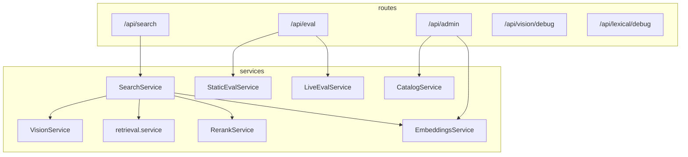

# Backend — Furniture Vision Search

Express + TypeScript API for catalog load, vision extraction, hybrid retrieval, LLM rerank, embeddings cache, and evaluation.

**Monorepo root:** [../README.md](../README.md) · **Pipeline:** [../docs/PIPELINE.md](../docs/PIPELINE.md) · **Eval:** [../docs/EVAL.md](../docs/EVAL.md)

---

## Quick start

From repo root (recommended):

```bash
cp .env.example .env   # set MONGODB_URI
docker compose up --build backend
```

Local dev (API on `:4000`):

```bash
cd backend
npm install
npm run dev
```

Requires root `.env` with `MONGODB_URI`. Optional `OPENROUTER_API_KEY` for dev fallback when client omits key (`NODE_ENV=development` only).

---

## Scripts

| Command | Description |
|---------|-------------|
| `npm run dev` | Watch mode via `tsx` |
| `npm run build` | Compile to `dist/` |
| `npm start` | Run compiled server |
| `npm test` | Vitest unit tests |
| `npm run test:watch` | Vitest watch |

---

## Architecture

```
HTTP routes (thin)  →  services (business logic)  →  catalog / LLM / cache
```



### Search pipeline (`SearchService`)

1. **Vision** — OpenRouter chat + image → catalog-constrained JSON (`VisionService`, `llm/prompts.ts`)
2. **Filter** — optional category/type hard filter when confidence ≥ threshold
3. **Hybrid top-K** — vector cosine + MiniSearch lexical + attribute weights (`retrieval.service.ts`)
4. **Rerank top-N** — LLM with image + candidates → scores + reasons (`rerank.service.ts`)

### Key modules

| Path | Role |
|------|------|
| `src/config.ts` | Zod-validated env config (fail-fast) |
| `src/app/bootstrap.ts` | Startup: Mongo, catalog, lexical index, embedding cache load |
| `src/catalog/load.ts` | Mongo products + enrichment + vocab |
| `src/catalog/lexical.ts` | MiniSearch index |
| `src/services/embeddings.service.ts` | Lazy build, JSON cache, concurrent rate-limit-safe reindex |
| `src/services/embedding-retriever.ts` | `Retriever` impl — cosine over cached vectors |
| `src/services/retrieval.service.ts` | Hybrid scoring, `Retriever` interface (swap for Atlas later) |
| `src/llm/openai-compatible.ts` | OpenRouter client: vision, chat, embed |
| `src/schemas/` | Zod: LLM config, retrieval config, rerank output |
| `src/routes/` | Express routers — parse body, call services |
| `eval/` | Static eval cases + images |

### Data on disk

| Path | Purpose |
|------|---------|
| `data/embeddings.json` | Embedding cache (gitignored; Docker volume `backend-data`) |

Catalog hash in cache triggers rebuild when products change.

---

## API endpoints

| Method | Path | Description |
|--------|------|-------------|
| GET | `/api/health` | Mongo, catalog, lexical, embeddings status |
| POST | `/api/search` | Multipart: `image` + JSON `payload` (prompt, llmConfig, retrievalConfig) |
| POST | `/api/vision/debug` | Vision-only JSON |
| POST | `/api/lexical/debug` | Lexical search debug |
| GET | `/api/admin/catalog-meta` | Vocab, counts, embedding status |
| POST | `/api/admin/reindex` | Build embedding cache |
| GET | `/api/admin/reindex-progress` | SSE progress events |
| POST | `/api/eval/run` | Static eval harness (6 cases) |
| POST | `/api/eval/rate` | Live rating `{ searchId, productId, relevant }` |
| GET | `/api/eval/metrics` | Rolling precision@5/10, MRR |
| GET | `/api/eval/logs` | Recent in-memory search logs |

### Search request shape

`POST /api/search` — `multipart/form-data`:

- `image` — JPEG/PNG/WebP file
- `payload` — JSON string:

```json
{
  "userPrompt": "optional refinement",
  "llmConfig": {
    "apiKey": "sk-or-v1-...",
    "baseUrl": "https://openrouter.ai/api/v1",
    "visionModel": "openai/gpt-4o",
    "chatModel": "openai/gpt-4o",
    "embedModel": "openai/text-embedding-3-small"
  },
  "retrievalConfig": {
    "mode": "hybrid",
    "k": 30,
    "n": 10,
    "enableRerank": true,
    "useImageInRerank": true,
    "filterMode": "auto",
    "confidenceThreshold": 0.7,
    "weights": { "w_vec": 0.25, "w_lex": 0.2, "w_cat": 0.15, "w_type": 0.15, "w_color": 0.15, "w_style": 0.05, "w_mat": 0, "w_dim": 0.05 }
  }
}
```

API keys come from the client per request. Dev fallback: `OPENROUTER_API_KEY` in root `.env` when `NODE_ENV=development` and client omits key.

---

## Configuration

All env vars: root [`.env.example`](../.env.example).

| Group | Variables |
|-------|-----------|
| MongoDB | `MONGODB_URI`, `MONGODB_DB_NAME`, `MONGODB_PRODUCTS_COLLECTION` |
| LLM | `LLM_*`, `OPENROUTER_*` |
| Embeddings build | `EMBED_BATCH_SIZE`, `EMBED_BUILD_CONCURRENCY`, `EMBED_MIN_REQUEST_INTERVAL_MS`, `EMBED_MAX_RETRIES`, … |
| Upload | `MAX_UPLOAD_BYTES`, `JSON_BODY_LIMIT` |

Default hybrid weights live in `src/schemas/retrieval.ts` (`DEFAULT_SCORE_WEIGHTS`).

---

## Testing

```bash
npm test
```

Tests in `src/tests/` cover retrieval, rerank parsing, embeddings, eval, retry/backoff, vision schema normalization, etc.

---

## Design notes

- **Routes stay thin** — validation + HTTP mapping only; logic in services.
- **OpenRouter-only** — one OpenAI-compatible client for vision, chat, rerank, embeddings.
- **Graceful degradation** — missing embeddings → `w_vec=0`, lexical boosted, warning in response.
- **Rate-limit safe reindex** — concurrent batches, min interval between requests, exponential backoff on 429.
- **No API key persistence** — keys in request body only; redacted in LLM error messages.

---

## Docker

Built from `backend/Dockerfile`. Compose service mounts volume `backend-data:/app/data` for embedding cache persistence across restarts.
